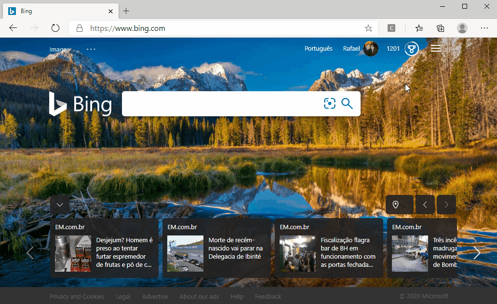

# bing-searches

This is a Chromium extension that makes automatic random searches on Bing. Great to achieve Microsoft Rewards Weekly Sets searches faster.

**This extension works on Google Chrome and also on the latest version of Microsoft Edge, as shown on the GIF below.**

## How to use

- Download or clone the source code;
- Go to [Bing](https://www.bing.com) and log into your Microsoft Rewards account;
- **If the Weekly Set requires searches to be made on mobile devices:**
  - Open Chrome DevTools (usually the shortcuts are Ctrl+Shift+I or just F12);
  - Toggle device toolbar (click on the two screens icon or press Ctrl+Shift+M);
  - Reload Bing page.
- Install and activate the extension on your browser (see Step 2 of [this](https://support.google.com/chrome/a/answer/2714278) link);
- Reload Bing page!
